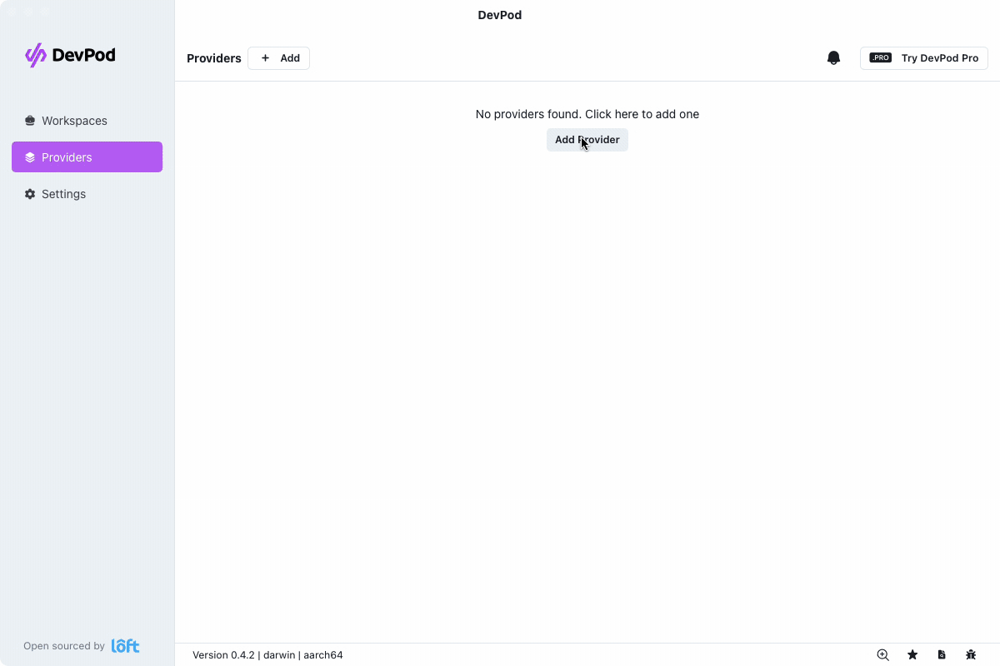

# [Canonical Multipass](https://multipass.run/) provider for [DevPod](https://github.com/loft-sh/devpod)

[](https://devpod.sh/open#https://github.com/minhio/devpod-provider-multipass)

## Prerequisites

- Install [Multipass](https://github.com/canonical/multipass)
- Install [DevPod](https://github.com/loft-sh/devpod)

## Getting started

The provider is available for auto-installation using DevPod CLI

```sh
devpod provider add minhio/devpod-provider-multipass
devpod provider use minhio/devpod-provider-multipass
```

Or the desktop app



## Customize the Multipass Instance

This provider has the following options

| NAME                | REQUIRED | DESCRIPTION                     | DEFAULT   |
|---------------------|----------|---------------------------------|-----------|
| MULTIPASS_PATH      | true     | Path to multipass binary.       | multipass |
| MULTIPASS_IMAGE     | true     | Image to launch.                | lts       |
| MULTIPASS_CPUS      | true     | Number of CPUs to allocate.     | 2         |
| MULTIPASS_DISK_SIZE | true     | Disk space to allocate.         | 40G       |
| MULTIPASS_MEMORY    | true     | Amount of memory to allocate.   | 4G        |
| MULTIPASS_MOUNTS    | false    | Comma separated list of mounts. |           |

See [https://multipass.run/docs/launch-command](https://multipass.run/docs/launch-command) for more detailed description of options.

`MULTIPASS_MOUNTS` is a comma separated list of `/absolute/local/path->/instance/path`.

- Relative instance path will be mounted in the `/home/devpod` directory.
- If instance path is omitted, the mount point will be the same as the local path. With the exception of windows, where it will be mounted in `/home/devpod`.

Examples:

- `/Users/minh/.aws->/home/devpod/.aws`: local path `/Users/minh/.aws` mounts to instance path `/home/devpod/.aws`
  - `/Users/minh/.aws->.aws` is the same as above
- `/Users/minh`: local path `/Users/minh` mounts to instance path `/Users/minh`
- `C:\Users\minh`: local path `C:\Users\minh` mounts to instance path `/home/devpod/C:/Users/minh`

The `MULTIPASS_MOUNTS` option enable users to mount local path to devcontainer via the multipass instance.

For example, to mount user's local `/Users/minh/.aws` directory to the devcontainer:

- Set `MULTIPASS_MOUNTS`=`/Users/minh/.aws->/home/devpod/.aws`
- Configure devcontainer mounts

```json
{
    "name": "Ubuntu",
    "image": "mcr.microsoft.com/devcontainers/base:jammy",
    "mounts": [
        "source=/home/devpod/.aws,target=/home/vscode/.aws,type=bind,consistency=cached"
    ]
}
```
